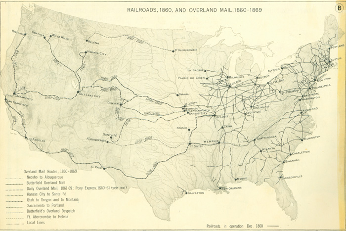

```{r global_options, include=FALSE}
knitr::opts_chunk$set(echo=FALSE)
```

##Immediate Family
* Father: [John McBride](../John McBride/Biography.PDF) (b. 1804)
* Mother: Olive C Vanarsdall
* Step-Mother: Mary J Caldwell
* Siblings:
    1. Matilda W McBride (b. 1832)
    2. William R McBride (b. 1834)
    3. George C McBride (b. 1836)
    4. Samuel H McBride (b. 1840)
    5. Syrena F McBride (b. 1845)
    6. Nancy Bell McBride (b. 1849)
* Step-Siblings:
    1. Felix Smith McBride (b. 1852)
    2. John C. McBride (b. 1855)
    3. Catherine?? McBride (b. 1858)
* Spouses:
    1. Francis Minton (b. 1849)
    2. Sophronia E (b. 1859)
* Children:
    1. Thomas Franklin McBride (b. 1870)
    2. Olive McBride (b. 1871)
    3. Letha McBride (b. 1874)
    4. Emma McBride (b. 1976)
    5. Hattie McBride (b. 1883)
    6. Lou A McBride (b. 1885) (May have been a step-daughter)
    7. Susie Mae McBride (b. 1892)
    8. William McBride (b. 1897)
    9. David McBride (b. 1902)
    10. Isaac McBride (b. 1904)
* Step-Children:
    1. Mary Minton (b. 1865)

##Bio

Isaac V McBride was born Isaac B McBride in 1842 in Kentucky according to his [headstone](Headstone.jpg) and [the 1850 US census](../John McBride/Censuses/1850 Census.jpg). Isaac's mother died in 1849 or 1850 when Isaac would have been seven or eight. At the time of the census he was living with his father and siblings 1-6 listed above in Boyle County Kentucky, where he was born. As an aside, Boyle county was founded the year he was born as a merger between Mercer and Lincoln Counties ([boyleky.com](http://boyleky.com), which, although lacking the .gov ending, appears to be their government website). The discrepancy in the middle initial would seem to indicate that I am documenting two different people, but the information contained on other census records, to me, make clear that they are the same guy. Isaac spent most of his adult life as a farmer, except for a brief stint as a cavalryman in the 1860's.

In [1860](Censuses/1860 Census part 2.jpg) Isaac is no longer living with his father, who passed away that year. I belive Isaac and his father had a falling out late in his father's life, since his father left Isaac one dollar in his [will](../John McBride/Will.jpg). That year he was a Farm Laborer living in the Elliott Township of San Joaquin California in the household of a man name Warner Philip. As the map below (online source found [here](http://railroads.unl.edu/documents/jpeg/medium/rail.str.0243.02.jpg)) shows, railways stopped at the Mississippi in 1860, so Isaac must have had a long overland journey. He lists his birth place as Kentucky on the 1860 census. I make a point of saying his listed birth place because things get muddy in later censuses.

On December 28\textsuperscript{th}, 1864, Isaac [enlisted](Service Record.jpg) and was [mustered](Military registration (line 480).jpg) into the California 2\textsuperscript{nd} Cavalry, company A in Sacramento. His enlistment record includes a description of his appearance. At the time of his enlistment, Isaac was five foot eleven with a "fair" complexion, blue eyes, and brown hair. His occupation is listed as "Laborer". Isaac's service record shows that he was a private until  July 15\textsuperscript{th}, 1865 when he was promoted to Corporal. Then on march 1\textsuperscript{st}, 1866 he became a Sergeant. He was discharged on April 7\textsuperscript{th}, 1866, a year and half after he enlisted. According to the national parks service ([external link](https://www.nps.gov/civilwar/search-battle-units-detail.htm?battleUnitCode=UCA0002RC)), his regiment only existed for another three months after his discharge. His company appears to have seen combat before he joined, but after he joined they were stationed at Camp Union in Sacramento for the remainder of their muster, so Isaac likely did not see any combat.


```{r, out.width = "\\linewidth", out.height="\\linewidth"}

```

On December 5\textsuperscript{th}, 1866, just nine months after he mustered out of the California 2\textsuperscript{nd} regiment, Isaac [enlisted](2nd military registration record.jpg) in the 8\textsuperscript{th} California Cavalry Regiment, Company A. He is two years older than when he enisted before, but his physical description remains mostly the same (listed as five foot ten and half, and as having "fair" hair). It is also worth noting that between his two enlistment records Isaac must have been one of the tallest members of California's armed services at the time. After five months, Isaac deserted his regiment on May 13\textsuperscript{th}, 1867. A [book](http://www.history.army.mil/books/R&H/R&H-8CV.htm) (external link) commisioned by the Military Service Institute claims that company A was stationed in Camp Winfield Scott, Nevada. In early 1867, before Isaac deserted, a subset of his company reportedly saw combat with a group of Native Americans. This seems like one possibile reason for him to desert. Another possibility is that he met his wife, Francis, and wanted to start a family. On both of his enlistment records, Isaac listed his place of birth as Boyle County Kentucky.

On October 5\textsuperscript{th}, 1868, Isaac [registered to vote](Voter registration (line 1373).jpg) in Union California. Based on the timing of his registration he may have planned to vote in the 1868 presidential election between Ulysses S. Grant (R) and Horatio Seymour (D). This would have been the first presidential election since Lincoln's assassination. He listed his occupation as "Farmer".

By [1870](Censuses/1870 Census (line 28).jpg) Isaac was married to his first wife, Francis, and their first son, Thomas was eight months old. His occupation is listed as "Farmer", and hers as "Keeping House". Living with them was Isaac's five year old step-daughter, Mary Minton. Together, the family had $\$1,400$ in real estate in the Butte township of Colusa County California. Somehow, Isaac not only got recorded twice in the 1870 census, but he was recorded twice on the same day by two different people. The [second time](Censuses/1870 census (2nd possibility).jpg) his location is listed as Kimshew township of Butte County California. Kimshew no longer exists as far as I could tell, but present day Butte City, Princeton (the town of the post office that recorded him in the first census), and Orville (the town of the second post office) are all very close to each other according to google maps. This leads me to believe his property straddled the two counties. There are some oddities about the second census worth noting. For one, Isaac's birthplace is listed as Missouri and his wife's as Tennessee. Mary's father was born in Missouri, so that could explain the confusion. To make things more confusing, on the first census his says Tennessee while his wife's says Kentucky, although they could have simply been flipped here. Second, Thomas Franklin is not listed, but there is a one year old named Frank. I belive this is the same person. A third oddity is, in addition to Francis, Mary, and Frank, they have living with them a 14 year old named Ellen Martin and a 16 year old named James Martin, both of whom were attending school.

By [1880](Censuses/1880 Census.jpg) Isaac, Francis (listed as "Fannie"), Frank, and Mary are living in the Dent township of Lawrence County, Arkansas. Isaac and his wife's birthplaces are listed as Kentucky and Tennessee respectively. Ten year old Frank's occupation is hard to read, but it looks like it says "Works on farm". In addition to Frank, they have at this time a nine year old Olive, six year olld Letha, and four year old Emma. Based on where the children were born, the family must have moved from California to Missouri between 1871 and 1874, and from Missouri to Arkansas between 1876 and 1880. By the 1880 census, the Martin children were no longer living with them.

I could not find Isaac McBride on the 1890 census. His wife had just passed away in 1889, so perhaps he was still dealing with that. He remarried in 1891 to a woman named Sophorina. This was her third marriage. By the time of the [1900](Censuses/1900 Census.jpg) census, all of the chidren from the 1880 census were out of the house. In their places were Hattie and Lou from his marriage to Francis, born in 1883 and 1885 respectively, and Susie and William from Sophorina, born 1892 and 1897 respectively. The [1910 census](Censuses/1910 Census.jpg) claims that Lou is Isaac's step-daughter and that her mother was born in Arkansas, where Sophronia was born. I have not found any more documents to corroborate either narrative. Hattie and Lou were in school, but Susie and William were not. By this time (and presumably earlier) Isaac could read and write. Again, Isaac's birthplace is listed as Kentucky on both censuses.

In 1902 and 1904, Isaac's third and fourth sons David and Isaac were born ([1910 census](Censuses/1910 Census.jpg)). Somewhere between 1880 and 1909 (part of his name was illegible in the 1900 census) Isaac B. became Isaac V. and in 1909 he [received a homestead](land patent image.PDF) via the homestead act of 1862 located at the coordinates shown [here](1909 land grant.htm). Isaac Died on September 14\textsuperscript{th}, 1913. His [headstone](Headstone.jpg) can be found in [Kelley Cemetery](http://arkansasgravestones.org/cemetery.php?cemID=392&pg=4) (external link) in Imboden Arkansas, along with many of his family members.